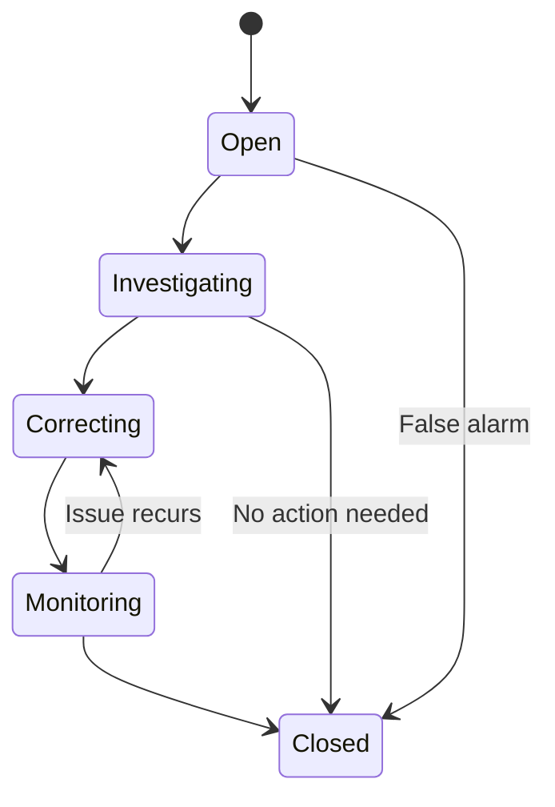

# 🚀 HACCP Business Manager - Project Map Ottimizzata

**Version:** 2.0  
**Date:** January 2025  
**Based on:** PRD v1.0 + User Requirements Analysis  
**Development Approach:** Agile/Scrum with 2-week sprints

---

## 📋 **PROJECT OVERVIEW**

### **Development Strategy**
- **Total Timeline**: 10-12 mesi per MVP completo (Steps A + B + C)
- **Team Size**: 2-3 developers full-time + 1 UX/UI designer part-time
- **Release Strategy**: Staged releases con beta testing per ogni step
- **Testing**: Continuous testing + User acceptance testing per ogni milestone

### **Success Criteria per Step**
- **Step A**: Onboarding completo funzionale + Basic navigation
- **Step B**: Core operations completamente operative offline/online
- **Step C**: Sistema di compliance completo pronto per produzione

---

## 🏗️ **STEP A - FONDAMENTA TECNICHE**
*Timeline stimata: 3-4 mesi (24-32 sprints)*

### **🎯 OBIETTIVI STEP A**
Costruire l'infrastruttura solida e l'onboarding completo che consenta agli utenti di configurare la propria azienda secondo normative HACCP.

### **📊 MILESTONE A.1: Setup Infrastruttura**
*Sprint 1-4 (2 mesi)*

#### **A.1.1 Repository & Development Environment**
```bash
Sprint 1-2: Base Setup
├── 🔧 Git repository structure + branching strategy
├── 🔧 Development environment configuration
├── 🔧 CI/CD pipeline setup (GitHub Actions)
├── 🔧 Code quality tools (ESLint, Prettier, Husky)
├── 🔧 Testing framework setup (Vitest + React Testing Library)
└── 🔧 Documentation structure (README, CONTRIBUTING)

Sprint 3-4: Architecture Foundation  
├── 🏗️ Project structure refactoring
├── 🏗️ TypeScript configuration + gradual migration
├── 🏗️ Service layer architecture design
├── 🏗️ Error handling & logging system
├── 🏗️ Environment configuration (dev/staging/prod)
└── 🏗️ Performance monitoring setup (Sentry)

Deliverable: ✅ Clean, scalable codebase foundation
Acceptance Criteria:
- ✅ 95%+ code coverage on utilities
- ✅ All linting rules passing
- ✅ Automated deployment to staging
- ✅ Error tracking operational
```

#### **A.1.2 Authentication System (Clerk Migration)**
```bash
Sprint 3-4: Clerk Integration
├── 🔐 Clerk configuration + API keys setup
├── 🔐 Migration from PIN system to email/password
├── 🔐 JWT token handling + session management
├── 🔐 Role-based access control (RBAC) implementation
├── 🔐 User registration/login flows
└── 🔐 Password reset + email verification

Sprint 5-6: Advanced Auth Features
├── 🔐 Multi-factor authentication (optional)
├── 🔐 Session persistence + refresh tokens
├── 🔐 User profile management
├── 🔐 Admin user creation workflow
├── 🔐 Auth state management (Context/Zustand)
└── 🔐 Security headers + CORS configuration

Deliverable: ✅ Complete authentication system
Acceptance Criteria:
- ✅ Secure login/logout functionality
- ✅ Role-based route protection
- ✅ Session management working offline
- ✅ MFA optional setup for admins
- ✅ Password security compliance
```

#### **A.1.3 Supabase Backend Setup**
```bash
Sprint 4-6: Database & API Layer
├── 📊 Supabase project setup + configuration
├── 📊 Database schema design (DDL)
├── 📊 Row Level Security (RLS) basic policies
├── 📊 API service layer abstraction
├── 📊 Real-time subscriptions setup
└── 📊 Data migration utilities

Database Schema Core Tables:
├── companies (multi-tenancy)
├── users (auth integration) 
├── departments (organizational structure)
├── conservation_points (monitoring locations)
├── staff_members (personnel management)
├── tasks (maintenance + general)
├── task_completions (execution tracking)
└── audit_logs (compliance tracking)

RLS Policies:
├── Tenant isolation (company_id filtering)
├── Role-based data access (admin/responsabile/dipendente)
├── Read/Write permissions per table
└── Audit trail protection (append-only)

Deliverable: ✅ Backend infrastructure completa
Acceptance Criteria:
- ✅ All core tables created with proper indexes
- ✅ RLS policies tested and secure
- ✅ API service layer with error handling
- ✅ Real-time updates working
- ✅ Data seeding for development
```

### **📊 MILESTONE A.2: UI Foundation**
*Sprint 5-8 (2 mesi)*

#### **A.2.1 Design System & Component Library**
```bash
Sprint 5-6: Core Components
├── 🎨 Tailwind CSS configuration + custom colors
├── 🎨 Typography system + font loading
├── 🎨 Icon system (Lucide React) + custom icons
├── 🎨 Button variations + states
├── 🎨 Form components (Input, Select, Checkbox, etc.)
└── 🎨 Card & CollapsibleCard redesign

Sprint 7-8: Advanced Components
├── 🎨 Modal system + overlays
├── 🎨 Tabs component optimization
├── 🎨 Navigation & routing
├── 🎨 Loading states + skeletons
├── 🎨 Toast notification system
└── 🎨 Responsive layout utilities

Deliverable: ✅ Design system completo
Acceptance Criteria:
- ✅ Component library documented (Storybook optional)
- ✅ Mobile-first responsive design
- ✅ Accessibility basics (ARIA labels, keyboard nav)
- ✅ Design tokens (colors, spacing, typography)
- ✅ Dark mode support (optional)
```

#### **A.2.2 Navigation Structure & PWA**
```bash
Sprint 7-8: App Shell & Navigation
├── 📱 Tab-based navigation system
├── 📱 Route protection + role-based access
├── 📱 App shell architecture (PWA)
├── 📱 Service Worker basic setup
├── 📱 Web App Manifest configuration
└── 📱 Install prompt + offline detection

Tab Structure Implementation:
├── 🏠 Home (Dashboard)
├── ❄️ Conservazione (Conservation Points)
├── ✅ Attività e Mansioni (Tasks & Maintenance)
├── 📦 Inventario (Inventory) [Placeholder]
├── ⚙️ Impostazioni e Dati (Settings) [Basic]
├── 👥 Gestione (Management) [Admin only]
└── 🤖 IA Assistant [Placeholder]

Deliverable: ✅ App shell navigabile
Acceptance Criteria:
- ✅ Smooth navigation between sections
- ✅ Role-based tab visibility
- ✅ PWA installable on mobile devices
- ✅ Offline detection working
- ✅ Performance: <3s initial load
```

### **📊 MILESTONE A.3: Onboarding Completo**
*Sprint 9-16 (4 mesi)*

#### **A.3.1 Wizard Setup & Business Data**
```bash
Sprint 9-10: Onboarding Infrastructure
├── 🧭 Multi-step wizard component
├── 🧭 Form validation system (Zod integration)
├── 🧭 Progress tracking + step navigation
├── 🧭 Data persistence between steps
├── 🧭 HACCP compliance validation
└── 🧭 Error handling + user guidance

Sprint 11-12: Business Configuration
├── 🏢 Company data collection form
├── 🏢 Address validation + geocoding (optional)
├── 🏢 Business type selection + HACCP requirements
├── 🏢 Contact information management
├── 🏢 Logo upload + basic branding
└── 🏢 Legal compliance checkboxes

Business Data Fields:
├── Nome attività * (validation: 3-100 chars)
├── Indirizzo completo * (validation: address format)
├── Numero dipendenti * (validation: 1-1000)
├── Email di riferimento * (validation: business email)
├── Telefono (validation: Italian format)
├── P.IVA/Codice Fiscale (validation: Italian tax codes)
└── Settore attività (preset: ristorazione, bar, pizzeria, etc.)

Deliverable: ✅ Business onboarding working
Acceptance Criteria:
- ✅ All required fields validated
- ✅ HACCP compliance guidance displayed
- ✅ Data saved securely to Supabase
- ✅ Progress can be resumed if interrupted
- ✅ Clear error messages + help text
```

#### **A.3.2 Departments & Organizational Structure**
```bash
Sprint 11-12: Department Management
├── 🏗️ Department preset system (Bancone, Sala, Magazzino, Cucina)
├── 🏗️ Custom department creation
├── 🏗️ Enable/disable department toggle
├── 🏗️ Department validation (min 1 required)
├── 🏗️ Manager assignment per department
└── 🏗️ Department-based filtering system

Sprint 13-14: Advanced Department Features
├── 🏗️ Department hierarchies (optional)
├── 🏗️ Location mapping (floor plans - future)
├── 🏗️ Equipment assignment per department
├── 🏗️ Access control by department
├── 🏗️ Department performance tracking
└── 🏗️ Bulk operations (enable/disable multiple)

Department Preset Configuration:
├── Bancone: {"name": "Bancone", "type": "service", "haccp_priority": "high"}
├── Sala: {"name": "Sala", "type": "service", "haccp_priority": "medium"}  
├── Magazzino: {"name": "Magazzino", "type": "storage", "haccp_priority": "high"}
├── Cucina: {"name": "Cucina", "type": "production", "haccp_priority": "critical"}
└── Custom: {"name": "user_defined", "type": "custom", "haccp_priority": "user_selected"}

Deliverable: ✅ Department management completo
Acceptance Criteria:
- ✅ All preset departments configurable
- ✅ Custom departments creation working
- ✅ Minimum 1 department validation
- ✅ Department data persisted correctly
- ✅ Manager assignment functional
```

#### **A.3.3 Staff Management System**
```bash
Sprint 13-14: Staff Core Features
├── 👥 Staff member registration form
├── 👥 Role management (Amministratore, Responsabile, Dipendente, Collaboratore Occasionale)
├── 👥 Category management (Amministratore, Banconista, Cuochi, Cameriere, Social & Media Manager)
├── 👥 HACCP certification tracking
├── 👥 Certification expiry alerts (3 months, 1 month, 1 week)
└── 👥 Staff validation (min 1 required)

Sprint 15-16: Advanced Staff Features
├── 👥 Bulk staff import/export
├── 👥 Staff performance tracking
├── 👥 Training record management
├── 👥 Shift scheduling (basic)
├── 👥 Staff photo management
└── 👥 Emergency contact information

Staff Data Model:
```typescript
interface StaffMember {
  id: string
  company_id: string
  full_name: string // Required
  role: 'admin' | 'responsabile' | 'dipendente' | 'collaboratore' // Required
  categories: string[] // Required, multiple selection
  email?: string
  phone?: string
  haccp_certification?: {
    level: 'base' | 'advanced'
    expiry_date: Date
    issuing_authority: string
    certificate_number: string
  }
  department_assignments: string[] // Department IDs
  hire_date: Date
  status: 'active' | 'inactive' | 'suspended'
  notes?: string
  created_at: Date
  updated_at: Date
}
```

Deliverable: ✅ Staff management completo
Acceptance Criteria:
- ✅ Staff member CRUD operations
- ✅ Role and category assignment working
- ✅ HACCP certification tracking functional
- ✅ Alert system for expiring certifications
- ✅ Minimum 1 staff member validation
- ✅ Data export for compliance reporting
```

#### **A.3.4 Conservation Points Configuration**
```bash
Sprint 15-16: Conservation Points Core
├── ❄️ Conservation point creation form
├── ❄️ Automatic classification (Ambiente, Frigorifero, Freezer, Abbattitore)
├── ❄️ Temperature range validation
├── ❄️ Product category assignment
├── ❄️ Department assignment
└── ❄️ HACCP compliance validation

Conservation Point Classification Logic:
```javascript
function classifyConservationPoint(temperature, checkboxes) {
  if (checkboxes.ambiente) return 'ambiente'
  if (checkboxes.abbattitore && temperature >= -99 && temperature <= -10) return 'abbattitore'
  if (temperature >= -90 && temperature <= 0) return 'freezer'
  if (temperature >= 0 && temperature <= 9) return 'frigorifero'
  throw new Error('Temperatura non valida per classificazione HACCP')
}
```

Sprint 17-18: Maintenance Planning
├── 🔧 Maintenance task templates (Rilevamento Temperature, Sbrinamento, Sanificazione)
├── 🔧 Frequency configuration per task type
├── 🔧 Staff assignment for maintenance
├── 🔧 Schedule generation algorithm
├── 🔧 Maintenance compliance tracking
└── 🔧 Alert system for overdue maintenance

Maintenance Task Configuration:
```typescript
interface MaintenanceTask {
  id: string
  conservation_point_id: string
  type: 'temperature_monitoring' | 'defrosting' | 'sanitization'
  frequency: 'daily' | 'weekly' | 'monthly' | 'quarterly' | 'annually' | 'custom'
  custom_days?: string[] // ['monday', 'wednesday', 'friday']
  assigned_to: {
    type: 'individual' | 'role' | 'category'
    value: string // staff_id | role | category
  }
  next_due_date: Date
  estimated_duration: number // minutes
  checklist?: string[]
  created_at: Date
}
```

Deliverable: ✅ Conservation points + Maintenance completi
Acceptance Criteria:
- ✅ Conservation point creation with validation
- ✅ Automatic classification working correctly
- ✅ Maintenance tasks auto-generated per point
- ✅ Staff assignment functional for maintenance
- ✅ HACCP compliance validation active
- ✅ Temperature range compatibility checking
```

#### **A.3.5 Basic Tasks & Onboarding Completion**
```bash
Sprint 17-18: General Tasks System
├── ✅ Generic task creation form
├── ✅ Task assignment (individual, role, category)
├── ✅ Frequency configuration
├── ✅ Task validation (min 1 required)
├── ✅ Calendar integration preparation
└── ✅ Task completion workflow design

Sprint 19-20: Onboarding Finalization
├── 🎯 Onboarding completion validation
├── 🎯 Data migration to main app sections
├── 🎯 Welcome tutorial creation
├── 🎯 Setup verification checklist
├── 🎯 Initial dashboard population
└── 🎯 User guidance system

Task Data Model:
```typescript
interface GeneralTask {
  id: string
  company_id: string
  name: string // Required
  description?: string
  frequency: FrequencyType // Required
  assigned_to: AssignmentType // Required
  department_id?: string
  priority: 'low' | 'medium' | 'high' | 'critical'
  estimated_duration: number
  checklist?: string[]
  next_due_date: Date
  created_by: string
  created_at: Date
  is_active: boolean
}
```

Onboarding Completion Checklist:
- ✅ Company data complete and validated
- ✅ At least 1 department configured
- ✅ At least 1 staff member registered
- ✅ At least 1 conservation point configured
- ✅ Maintenance tasks generated for all points
- ✅ At least 1 general task created
- ✅ HACCP compliance validation passed
- ✅ User account linked to company

Deliverable: ✅ Onboarding completamente funzionale
Acceptance Criteria:
- ✅ Complete onboarding flow working end-to-end
- ✅ All required data collected and validated
- ✅ Seamless transition to main app
- ✅ Data integrity verification
- ✅ User can start using core features immediately
```

### **🎯 STEP A DELIVERABLES & ACCEPTANCE**

#### **Technical Deliverables**
- ✅ Scalable codebase with TypeScript migration started
- ✅ Clerk authentication fully integrated
- ✅ Supabase backend with secure RLS policies
- ✅ PWA app shell with offline detection
- ✅ Complete design system and component library

#### **Functional Deliverables**  
- ✅ Complete onboarding wizard (company → departments → staff → conservation points → maintenance → tasks)
- ✅ Multi-role access control working
- ✅ Data validation and HACCP compliance checking
- ✅ Audit trail foundation for all operations

#### **Acceptance Criteria for Step A**
```
User Story: "As a restaurant owner, I can complete the onboarding process 
and have my business configured according to HACCP requirements."

Acceptance Tests:
├── ✅ Complete onboarding in <30 minutes
├── ✅ All required HACCP data collected
├── ✅ System generates maintenance schedules automatically
├── ✅ Access control working for different user roles
├── ✅ Data persisted securely with audit trail
├── ✅ App works offline for basic navigation
├── ✅ PWA installable on mobile devices
└── ✅ No critical bugs in core onboarding flow
```

---

## ⚙️ **STEP B - CORE OPERATIONS**
*Timeline stimata: 4-5 mesi (32-40 sprints)*

### **🎯 OBIETTIVI STEP B**
Implementare le operazioni core che permettono l'uso quotidiano del sistema: calendario unificato, sistema di note, logging temperature, gestione non conformità e sistema offline completo.

### **📊 MILESTONE B.1: Calendario Unificato (FullCalendar)**
*Sprint 21-28 (4 mesi)*

#### **B.1.1 Calendar Integration & Setup**
```bash
Sprint 21-22: FullCalendar Foundation
├── 📅 FullCalendar installation + configuration
├── 📅 Custom theme matching app design
├── 📅 Multi-view support (day/week/month)
├── 📅 Event data source integration
├── 📅 Real-time updates with Supabase
└── 📅 Mobile responsive calendar

Sprint 23-24: Event Management
├── 📅 Maintenance task rendering on calendar
├── 📅 General task rendering on calendar
├── 📅 Event color coding by type/status
├── 📅 Event click handlers + details modal
├── 📅 Quick completion actions from calendar
└── 📅 Event filtering system

Calendar Configuration:
```typescript
interface CalendarEvent {
  id: string
  title: string
  start: Date
  end?: Date
  allDay: boolean
  type: 'maintenance' | 'general_task' | 'reminder'
  status: 'pending' | 'completed' | 'overdue' | 'cancelled'
  assigned_to: string[]
  department: string
  priority: 'low' | 'medium' | 'high' | 'critical'
  conservation_point_id?: string
  recurring: boolean
  backgroundColor: string
  borderColor: string
  textColor: string
}
```

Deliverable: ✅ Calendar foundation working
Acceptance Criteria:
- ✅ FullCalendar rendering correctly on all devices
- ✅ Events populated from maintenance + tasks data
- ✅ Real-time updates when data changes
- ✅ Mobile-friendly touch interactions
- ✅ Performance: <2s to load calendar view
```

#### **B.1.2 Advanced Calendar Features**
```bash
Sprint 25-26: Interactive Features
├── 📅 Drag & drop rescheduling (admin/responsabile only)
├── 📅 Event creation directly from calendar
├── 📅 Bulk operations (mark multiple complete)
├── 📅 Calendar export (iCal/Google Calendar)
├── 📅 Print view optimization
└── 📅 Keyboard navigation support

Sprint 27-28: Filtering & Views
├── 📅 Department-based filtering
├── 📅 User-based filtering (my tasks vs all)
├── 📅 Task type filtering (maintenance vs general)
├── 📅 Status filtering (pending/completed/overdue)
├── 📅 Custom view configurations
└── 📅 Filter persistence (user preferences)

Advanced Filter System:
```typescript
interface CalendarFilters {
  departments: string[]
  assigned_users: string[]
  task_types: ('maintenance' | 'general_task')[]
  statuses: ('pending' | 'completed' | 'overdue')[]
  priority_levels: ('low' | 'medium' | 'high' | 'critical')[]
  date_range: {
    start: Date
    end: Date
  }
  conservation_points?: string[]
}
```

Deliverable: ✅ Calendar completo con funzionalità avanzate
Acceptance Criteria:
- ✅ Drag & drop rescheduling working
- ✅ Comprehensive filtering system operational
- ✅ Export functionality working
- ✅ User preferences saved and restored
- ✅ Performance maintained with 1000+ events
```

### **📊 MILESTONE B.2: Sistema Note e Comunicazioni**
*Sprint 25-30 (3 mesi)*

#### **B.2.1 Mini-Messages Core System**
```bash
Sprint 25-26: Note Infrastructure
├── 💬 Note data model design
├── 💬 CRUD operations for notes
├── 💬 Real-time updates with Supabase
├── 💬 Note threading (replies)
├── 💬 Rich text support (basic formatting)
└── 💬 File attachment support

Sprint 27-28: Note Types & Context
├── 💬 Notes on conservation points
├── 💬 Notes on tasks (maintenance + general)
├── 💬 General company notes (announcements)
├── 💬 Private notes vs shared notes
├── 💬 Note categories and tags
└── 💬 Search functionality

Note Data Model:
```typescript
interface Note {
  id: string
  company_id: string
  author_id: string
  author_name: string
  content: string
  type: 'task' | 'conservation_point' | 'general' | 'announcement'
  context_id?: string // task_id or conservation_point_id
  visibility: 'public' | 'department' | 'role' | 'private'
  priority: 'low' | 'medium' | 'high' | 'urgent'
  tags: string[]
  attachments?: {
    url: string
    filename: string
    size: number
    type: string
  }[]
  parent_note_id?: string // for threading
  is_read_by: string[] // user_ids who have read this note
  created_at: Date
  updated_at: Date
}
```

Deliverable: ✅ Sistema note base operativo
Acceptance Criteria:
- ✅ CRUD operations working for all note types
- ✅ Real-time updates visible to all users
- ✅ Note threading functional
- ✅ File attachments working (images, PDFs)
- ✅ Search returning relevant results quickly
```

#### **B.2.2 Advanced Communication Features**
```bash
Sprint 29-30: Enhanced Features
├── 💬 @mention system with notifications
├── 💬 Note status tracking (read/unread)
├── 💬 Note assignment (actionable notes)
├── 💬 Automatic note creation (system events)
├── 💬 Note export functionality
└── 💬 Mobile push notifications setup

Sprint 31-32: Integration & Polish
├── 💬 Integration with task completion workflow
├── 💬 Integration with maintenance alerts
├── 💬 Note archiving system
├── 💬 Spam prevention and moderation
├── 💬 Note analytics (most active users, etc.)
└── 💬 Offline note creation support

Communication Workflow Examples:
```typescript
// Automatic note creation examples
const systemNotes = [
  {
    trigger: 'task_overdue',
    template: 'Task "{task_name}" is overdue. Assigned to: {assigned_to}',
    type: 'urgent'
  },
  {
    trigger: 'maintenance_completed', 
    template: 'Maintenance "{maintenance_type}" completed on {conservation_point}',
    type: 'low'
  },
  {
    trigger: 'temperature_violation',
    template: 'Temperature violation detected on {conservation_point}: {temperature}°C',
    type: 'urgent'
  }
]
```

Deliverable: ✅ Sistema comunicazioni completo
Acceptance Criteria:
- ✅ @mention notifications working
- ✅ Push notifications operational
- ✅ System automatically creates relevant notes
- ✅ Offline note creation with sync
- ✅ Note archiving and cleanup working
```

### **📊 MILESTONE B.3: Temperature Logging & Non Conformance**
*Sprint 29-36 (4 mesi)*

#### **B.3.1 Temperature Recording System**
```bash
Sprint 29-30: Basic Temperature Logging
├── 🌡️ Temperature entry form design
├── 🌡️ Conservation point selection
├── 🌡️ Temperature validation rules
├── 🌡️ Timestamp and user tracking
├── 🌡️ Bulk temperature entry
└── 🌡️ Temperature history visualization

Sprint 31-32: Advanced Temperature Features
├── 🌡️ Temperature trend analysis
├── 🌡️ Automatic anomaly detection
├── 🌡️ Chart visualization (Chart.js integration)
├── 🌡️ Temperature export for compliance
├── 🌡️ Photo evidence support
└── 🌡️ Voice input support (Speech API)

Temperature Data Model:
```typescript
interface TemperatureReading {
  id: string
  company_id: string
  conservation_point_id: string
  conservation_point_name: string
  temperature: number // Celsius
  target_temperature: number
  tolerance_range: { min: number, max: number }
  status: 'compliant' | 'warning' | 'critical'
  recorded_by: string
  recorded_at: Date
  method: 'manual' | 'digital_thermometer' | 'automatic_sensor'
  notes?: string
  photo_evidence?: string // Supabase storage URL
  validation_status: 'pending' | 'validated' | 'flagged'
  created_at: Date
}
```

Temperature Validation Logic:
```typescript
function validateTemperature(reading: number, target: number, tolerance: number) {
  const minTemp = target - tolerance
  const maxTemp = target + tolerance
  
  if (reading >= minTemp && reading <= maxTemp) return 'compliant'
  if (reading >= minTemp - 2 && reading <= maxTemp + 2) return 'warning'
  return 'critical'
}
```

Deliverable: ✅ Temperature logging completo
Acceptance Criteria:
- ✅ Temperature recording working on all devices
- ✅ Automatic validation and status assignment
- ✅ Chart visualization showing trends
- ✅ Photo evidence upload functional
- ✅ Export functionality for compliance reports
```

#### **B.3.2 Non-Conformance Management**
```bash
Sprint 33-34: NC Detection & Creation
├── 🚨 Automatic non-conformance detection
├── 🚨 Manual non-conformance reporting
├── 🚨 NC categorization system
├── 🚨 Severity level assignment
├── 🚨 Responsible party assignment
└── 🚨 NC status workflow

Sprint 35-36: NC Resolution & Tracking
├── 🚨 Corrective action planning
├── 🚨 Root cause analysis forms
├── 🚨 Resolution tracking and validation
├── 🚨 NC analytics and trends
├── 🚨 Recurring NC prevention
└── 🚨 Compliance reporting integration

Non-Conformance Data Model:
```typescript
interface NonConformance {
  id: string
  company_id: string
  type: 'temperature' | 'cleanliness' | 'procedure' | 'equipment' | 'documentation' | 'other'
  severity: 'minor' | 'major' | 'critical'
  status: 'open' | 'investigating' | 'correcting' | 'monitoring' | 'closed'
  
  // Context
  conservation_point_id?: string
  task_id?: string
  department_id?: string
  
  // Description
  title: string
  description: string
  detected_by: string
  detected_at: Date
  
  // Evidence
  photo_evidence?: string[]
  temperature_reading_id?: string
  
  // Resolution
  root_cause?: string
  corrective_actions: {
    action: string
    responsible: string
    due_date: Date
    status: 'pending' | 'in_progress' | 'completed'
    completion_date?: Date
    notes?: string
  }[]
  
  // Validation
  verified_by?: string
  verified_at?: Date
  follow_up_required: boolean
  follow_up_date?: Date
  
  created_at: Date
  updated_at: Date
}
```

NC Workflow States:


Deliverable: ✅ Sistema non-conformance completo
Acceptance Criteria:
- ✅ Automatic NC detection from temperature violations
- ✅ Manual NC reporting functional
- ✅ Complete workflow from detection to closure
- ✅ Corrective action tracking working
- ✅ Analytics showing NC trends and patterns
```

### **📊 MILESTONE B.4: Sistema Notifiche**
*Sprint 33-38 (3 mesi)*

#### **B.4.1 Web Push Notifications**
```bash
Sprint 33-34: Push Infrastructure
├── 🔔 Service Worker push notification setup
├── 🔔 Push subscription management
├── 🔔 Notification permission handling
├── 🔔 VAPID keys configuration
├── 🔔 Notification delivery service
└── 🔔 Cross-browser compatibility

Sprint 35-36: Notification Types & Triggers
├── 🔔 Task due/overdue notifications
├── 🔔 Temperature violation alerts
├── 🔔 Maintenance reminders
├── 🔔 Staff certification expiry alerts
├── 🔔 New message/note notifications
└── 🔔 System status updates

Notification Configuration:
```typescript
interface NotificationRule {
  id: string
  company_id: string
  type: 'task_due' | 'temperature_violation' | 'maintenance_due' | 'cert_expiry' | 'message' | 'system'
  trigger_conditions: {
    hours_before?: number
    severity_level?: 'low' | 'medium' | 'high' | 'critical'
    departments?: string[]
    roles?: string[]
  }
  recipients: {
    type: 'all' | 'role' | 'individual' | 'department'
    values: string[]
  }
  delivery_method: ('push' | 'email' | 'sms')[]
  message_template: string
  is_active: boolean
  created_at: Date
}
```

Deliverable: ✅ Sistema notifiche base operativo
Acceptance Criteria:
- ✅ Push notifications working on all supported browsers
- ✅ Users can enable/disable notification types
- ✅ Notifications delivered in real-time
- ✅ Click actions working (open specific app section)
- ✅ Batch notifications for multiple events
```

#### **B.4.2 Advanced Notification Features**
```bash
Sprint 37-38: Enhanced Notifications
├── 🔔 Notification scheduling system
├── 🔔 Quiet hours configuration
├── 🔔 Notification history and read receipts
├── 🔔 Escalation rules (if not acknowledged)
├── 🔔 Custom notification sounds
└── 🔔 Rich notifications with actions

Notification Scheduling Examples:
```typescript
const notificationRules = [
  {
    type: 'maintenance_due',
    schedule: [
      { hours_before: 24, message: 'Maintenance due tomorrow: {task_name}' },
      { hours_before: 2, message: 'Maintenance due in 2 hours: {task_name}' },
      { hours_overdue: 1, message: 'OVERDUE: Maintenance required: {task_name}' }
    ]
  },
  {
    type: 'cert_expiry',
    schedule: [
      { days_before: 90, message: 'HACCP cert expires in 3 months: {staff_name}' },
      { days_before: 30, message: 'HACCP cert expires in 1 month: {staff_name}' },
      { days_before: 7, message: 'URGENT: HACCP cert expires in 1 week: {staff_name}' }
    ]
  }
]
```

Deliverable: ✅ Sistema notifiche avanzato completo
Acceptance Criteria:
- ✅ Scheduling system working for all notification types
- ✅ Quiet hours respected
- ✅ Escalation working for critical notifications
- ✅ Rich notifications with inline actions
- ✅ Notification analytics (delivery rates, etc.)
```

### **📊 MILESTONE B.5: Sistema Offline v1**
*Sprint 35-40 (3 mesi)*

#### **B.5.1 Offline Infrastructure**
```bash
Sprint 35-36: Service Worker & Caching
├── 📱 Advanced Service Worker implementation
├── 📱 Cache strategies for different resource types
├── 📱 Background sync setup
├── 📱 Offline detection and UI states
├── 📱 Data synchronization queue
└── 📱 Conflict resolution preparation

Sprint 37-38: Outbox System
├── 📱 localStorage outbox implementation
├── 📱 Operation queuing system
├── 📱 Retry logic with exponential backoff
├── 📱 Data deduplication system
├── 📱 Network queue management
└── 📱 Sync status indicators

Outbox Data Structure:
```typescript
interface OutboxOperation {
  id: string
  timestamp: Date
  entity: 'temperature_reading' | 'task_completion' | 'note' | 'product' | 'conservation_point'
  operation: 'create' | 'update' | 'delete'
  payload: any
  dedup_key?: string
  base_updated_at?: Date
  retry_count: number
  max_retries: number
  status: 'pending' | 'syncing' | 'completed' | 'failed'
  error_message?: string
}
```

Sync Strategy Implementation:
```typescript
const syncStrategies = {
  // Append-only entities (no conflicts possible)
  temperature_readings: {
    strategy: 'append_only',
    dedup_key: '${conservation_point_id}_${taken_at}',
    conflict_resolution: null
  },
  
  // Last-Write-Wins entities
  products: {
    strategy: 'last_write_wins',
    dedup_key: '${id}',
    conflict_resolution: 'server_timestamp_wins'
  },
  
  // Idempotent entities
  task_completions: {
    strategy: 'idempotent',
    dedup_key: '${task_id}_${due_date}',
    conflict_resolution: 'ignore_duplicate'
  }
}
```

Deliverable: ✅ Offline infrastructure funzionante
Acceptance Criteria:
- ✅ App works completely offline for core operations
- ✅ Data synchronizes automatically when back online
- ✅ No data loss during offline/online transitions
- ✅ Conflict resolution working for different data types
- ✅ User feedback for sync status clearly visible
```

#### **B.5.2 Offline Operations**
```bash
Sprint 39-40: Offline CRUD Operations
├── 📱 Offline temperature logging
├── 📱 Offline task completion
├── 📱 Offline note creation
├── 📱 Offline conservation point management
├── 📱 Offline staff management
└── 📱 Offline calendar viewing

Offline Capability Matrix:
```typescript
const offlineCapabilities = {
  temperature_logging: {
    create: true,    // Queue for sync
    read: true,      // From cache
    update: false,   // Temperatures are immutable
    delete: false    // Compliance requirement
  },
  task_completion: {
    create: true,    // Queue for sync
    read: true,      // From cache
    update: true,    // Allow corrections offline
    delete: false    // Audit trail requirement
  },
  notes: {
    create: true,    // Queue for sync
    read: true,      // From cache
    update: true,    // Allow editing offline
    delete: true     // Soft delete, queue for sync
  },
  conservation_points: {
    create: true,    // Queue for sync
    read: true,      // From cache
    update: true,    // Queue for sync
    delete: true     // Queue for sync
  }
}
```

Data Caching Strategy:
```typescript
const cacheConfig = {
  // Critical data - always cache
  essential: [
    'conservation_points',
    'staff_members', 
    'departments',
    'active_tasks'
  ],
  
  // Historical data - configurable cache duration
  historical: [
    'temperature_readings', // Last 30 days
    'completed_tasks',      // Last 7 days
    'notes'                 // Last 30 days
  ],
  
  // Large assets - cache on demand
  assets: [
    'product_photos',
    'label_images',
    'exported_reports'
  ]
}
```

Deliverable: ✅ Offline operations complete
Acceptance Criteria:
- ✅ All core operations work offline
- ✅ Data cached efficiently (configurable retention)
- ✅ Offline changes sync correctly when online
- ✅ User can configure offline data retention
- ✅ Storage usage monitoring and cleanup
```

### **🎯 STEP B DELIVERABLES & ACCEPTANCE**

#### **Technical Deliverables**
- ✅ FullCalendar integration with real-time updates
- ✅ Complete communication system with push notifications
- ✅ Temperature logging with automatic validation
- ✅ Non-conformance management workflow
- ✅ Full offline capability with sync

#### **Functional Deliverables**
- ✅ Unified calendar showing all tasks and maintenance
- ✅ Real-time communication between team members
- ✅ HACCP-compliant temperature tracking
- ✅ Automated non-conformance detection and resolution
- ✅ Complete offline/online operation capability

#### **Acceptance Criteria for Step B**
```
User Story: "As a restaurant staff member, I can use the app daily to complete 
my tasks, record temperatures, communicate with the team, and receive 
notifications - even when the internet connection is unreliable."

Acceptance Tests:
├── ✅ Complete a maintenance task via calendar interface
├── ✅ Log temperatures and receive automatic compliance validation  
├── ✅ Send and receive notes with real-time updates
├── ✅ Receive push notifications for overdue tasks
├── ✅ Work offline for entire shift, sync when back online
├── ✅ View non-conformances and corrective actions
├── ✅ Export compliance data for inspections
└── ✅ Performance: <2s for all major operations
```

---

## 🎯 **STEP C - COMPLIANCE & POLISH**
*Timeline stimata: 3-4 mesi (24-32 sprints)*

### **🎯 OBIETTIVI STEP C**
Completare il sistema con inventario completo, lista spesa PDF, dashboard KPI, sistema export completo e polish finale per produzione.

### **📊 MILESTONE C.1: Sistema Inventario Completo**
*Sprint 41-50 (5 mesi)*

#### **C.1.1 Product Management Core**
```bash
Sprint 41-42: Basic Inventory CRUD
├── 📦 Product creation form with validation
├── 📦 Product category system (preset + custom)
├── 📦 Expiration date tracking
├── 📦 Conservation point assignment
├── 📦 Department assignment
└── 📦 Basic product search and filtering

Sprint 43-44: Advanced Product Features  
├── 📦 Allergen tracking system
├── 📦 Photo label management (Supabase Storage)
├── 📦 Batch operations (bulk edit, bulk delete)
├── 📦 Product history tracking
├── 📦 Supplier information management
└── 📦 Product notes and annotations

Product Data Model (Extended):
```typescript
interface Product {
  id: string
  company_id: string
  name: string // Required
  category_id: string // Required - links to ProductCategory
  department_id: string // Required
  conservation_point_id?: string
  
  // Identification
  barcode?: string
  sku?: string
  supplier_id?: string
  supplier_name?: string
  
  // Dates & Quantities
  purchase_date?: Date
  expiry_date?: Date
  quantity?: number
  unit?: string // kg, L, pieces, etc.
  
  // Safety & Compliance
  allergens: AllergenType[]
  temperature_requirements: {
    min_temp: number
    max_temp: number
    storage_type: 'ambiente' | 'frigorifero' | 'freezer' | 'abbattitore'
  }
  
  // Documentation
  label_photo_url?: string
  certificate_url?: string // For products requiring certifications
  notes?: string
  
  // Status
  status: 'active' | 'expired' | 'consumed' | 'waste'
  compliance_status: 'compliant' | 'warning' | 'non_compliant'
  
  // Audit
  created_by: string
  created_at: Date
  updated_by: string
  updated_at: Date
}

interface ProductCategory {
  id: string
  company_id: string
  name: string
  description?: string
  is_preset: boolean
  temperature_range: {
    min: number
    max: number
    ambient_allowed: boolean
  }
  typical_shelf_life?: number // days
  allergen_warnings?: AllergenType[]
  color_code?: string
  created_at: Date
}

enum AllergenType {
  GLUTINE = 'glutine',
  LATTE = 'latte', 
  UOVA = 'uova',
  SOIA = 'soia',
  FRUTTA_GUSCIO = 'frutta_guscio',
  ARACHIDI = 'arachidi',
  PESCE = 'pesce',
  CROSTACEI = 'crostacei'
}
```

Deliverable: ✅ Sistema inventario base completo
Acceptance Criteria:
- ✅ Product CRUD operations working
- ✅ Category system (preset + custom) functional
- ✅ Allergen tracking complete
- ✅ Photo upload and management working
- ✅ Search and filtering responsive and fast
```

#### **C.1.2 Expiry Management & "Scaduti" System**
```bash
Sprint 45-46: Expiry Tracking
├── 📦 Automatic expiry date monitoring
├── 📦 Configurable expiry alerts (3, 5, 7 days before)
├── 📦 "Prodotti in Scadenza" dashboard section
├── 📦 Color-coded expiry indicators
├── 📦 Batch expiry notifications
└── 📦 Expiry trend analytics

Sprint 47-48: Expired Products Management
├── 📦 Automatic migration to "Prodotti Scaduti" section
├── 📦 Expired product reinsertion workflow
├── 📦 New expiry date assignment
├── 📦 Waste tracking and reporting
├── 📦 Cost analysis for expired products
└── 📦 Prevention recommendations

Expiry Management Logic:
```typescript
interface ExpiryAlert {
  id: string
  product_id: string
  alert_type: 'approaching' | 'expired' | 'critical'
  days_until_expiry: number
  sent_at: Date
  acknowledged_by?: string
  action_taken?: 'consumed' | 'waste' | 'extended' | 'reinsertion'
}

const expiryStatus = (expiryDate: Date): 'fresh' | 'approaching' | 'critical' | 'expired' => {
  const today = new Date()
  const daysUntilExpiry = Math.ceil((expiryDate.getTime() - today.getTime()) / (1000 * 60 * 60 * 24))
  
  if (daysUntilExpiry < 0) return 'expired'
  if (daysUntilExpiry <= 1) return 'critical' 
  if (daysUntilExpiry <= 3) return 'approaching'
  return 'fresh'
}

// Reinsertion workflow
const reinsertExpiredProduct = async (expiredProductId: string, newExpiryDate: Date) => {
  const expiredProduct = await getExpiredProduct(expiredProductId)
  
  const newProduct = {
    ...expiredProduct,
    id: generateUUID(),
    expiry_date: newExpiryDate,
    status: 'active',
    previous_product_id: expiredProductId, // Track relationship
    reinsertion_count: (expiredProduct.reinsertion_count || 0) + 1,
    created_at: new Date()
  }
  
  await createProduct(newProduct)
  await archiveExpiredProduct(expiredProductId)
  return newProduct
}
```

Deliverable: ✅ Gestione scadenze completa
Acceptance Criteria:
- ✅ Automatic expiry monitoring working
- ✅ Alert system functional with configurable timing
- ✅ Expired products section populated automatically
- ✅ Reinsertion workflow smooth and intuitive
- ✅ Analytics showing waste reduction over time
```

#### **C.1.3 Advanced Inventory Features**
```bash
Sprint 49-50: Advanced Features
├── 📦 Inventory valuation (FIFO/LIFO/Average cost)
├── 📦 Stock level management and reorder points
├── 📦 Supplier performance tracking
├── 📦 Seasonal product planning
├── 📦 Integration with conservation point temperatures
└── 📦 Mobile barcode scanning (future preparation)

Advanced Filtering System:
```typescript
interface InventoryFilters {
  // Basic filters
  name?: string
  category_ids?: string[]
  department_ids?: string[]
  conservation_point_ids?: string[]
  
  // Date filters
  purchase_date_range?: { start: Date, end: Date }
  expiry_date_range?: { start: Date, end: Date }
  
  // Status filters
  status?: ('active' | 'expired' | 'consumed' | 'waste')[]
  compliance_status?: ('compliant' | 'warning' | 'non_compliant')[]
  expiry_status?: ('fresh' | 'approaching' | 'critical' | 'expired')[]
  
  // Allergen filters
  allergens?: {
    include?: AllergenType[]
    exclude?: AllergenType[]
    mode: 'any' | 'all' | 'none'
  }
  
  // Quantity filters  
  quantity_range?: { min: number, max: number }
  low_stock_only?: boolean
  
  // Advanced filters
  suppliers?: string[]
  temperature_range?: { min: number, max: number }
  created_by?: string[]
  
  // Sorting
  sort_by: 'name' | 'expiry_date' | 'created_at' | 'category' | 'quantity'
  sort_order: 'asc' | 'desc'
}
```

Deliverable: ✅ Inventario avanzato completo
Acceptance Criteria:
- ✅ Advanced filtering system working efficiently
- ✅ Stock level management functional
- ✅ Supplier tracking operational
- ✅ Mobile-optimized interface
- ✅ Performance maintained with 10,000+ products
```

### **📊 MILESTONE C.2: Lista Spesa & PDF Generation**
*Sprint 49-52 (2 mesi)*

#### **C.2.1 Shopping List Core Features**
```bash
Sprint 49-50: Basic Shopping List
├── 🛒 Product selection interface with checkboxes
├── 🛒 Shopping list creation and management
├── 🛒 Quantity specification for each item
├── 🛒 Category grouping in lists
├── 🛒 List saving and history (2 weeks retention)
└── 🛒 Basic PDF generation with jsPDF

Sprint 51-52: Advanced Shopping Features
├── 🛒 Advanced filtering for product selection
├── 🛒 Template lists for recurring purchases
├── 🛒 Cost estimation and budgeting
├── 🛒 Supplier-based list separation
├── 🛒 List sharing between staff members
└── 🛒 Mobile-optimized PDF formatting

Shopping List Data Model:
```typescript
interface ShoppingList {
  id: string
  company_id: string
  name: string
  created_by: string
  created_at: Date
  
  // Status
  status: 'draft' | 'finalized' | 'in_progress' | 'completed'
  
  // Items
  items: ShoppingListItem[]
  
  // Organization
  category_grouping: boolean
  supplier_grouping: boolean
  
  // Metadata
  estimated_total?: number
  notes?: string
  due_date?: Date
  
  // History
  generated_pdf_url?: string
  completed_at?: Date
  completed_by?: string
}

interface ShoppingListItem {
  id: string
  product_name: string
  category: string
  quantity?: number
  unit?: string
  estimated_cost?: number
  priority: 'low' | 'medium' | 'high' | 'urgent'
  notes?: string
  
  // Reference to original product (if applicable)
  original_product_id?: string
  conservation_point_id?: string
  department_id?: string
  
  // Status
  status: 'pending' | 'purchased' | 'unavailable' | 'substituted'
  actual_cost?: number
  actual_quantity?: number
}
```

PDF Generation Configuration:
```typescript
const pdfConfig = {
  format: 'A4',
  margin: 20,
  
  header: {
    company_name: true,
    logo: true,
    list_date: true,
    created_by: true
  },
  
  grouping: {
    by_category: true,
    by_supplier: false, // Configurable
    by_department: false,
    by_priority: false
  },
  
  columns: [
    'product_name',
    'quantity',
    'category', 
    'notes',
    'estimated_cost' // Optional
  ],
  
  footer: {
    total_items: true,
    estimated_total: true,
    generation_timestamp: true
  }
}
```

Deliverable: ✅ Sistema lista spesa completo
Acceptance Criteria:
- ✅ Product selection interface intuitive and fast
- ✅ PDF generation working on all devices
- ✅ List history with 2-week retention
- ✅ Advanced filtering functional
- ✅ Mobile PDF formatting optimized
```

### **📊 MILESTONE C.3: Dashboard KPI & Analytics**
*Sprint 51-56 (3 mesi)*

#### **C.3.1 Core Dashboard Development**
```bash
Sprint 51-52: Dashboard Foundation
├── 📊 Dashboard layout design and responsiveness
├── 📊 KPI card components
├── 📊 Chart integration (Chart.js or similar)
├── 📊 Real-time data updates
├── 📊 Role-based dashboard customization
└── 📊 Performance optimization for data aggregation

Sprint 53-54: KPI Implementation
├── 📊 Compliance score calculation and display
├── 📊 Task completion rates
├── 📊 Temperature compliance trends
├── 📊 Non-conformance analytics
├── 📊 Inventory turnover metrics
└── 📊 Staff performance indicators

Dashboard KPI Definitions:
```typescript
interface DashboardKPIs {
  // Compliance Metrics
  overall_compliance_score: {
    value: number // 0-100
    trend: 'up' | 'down' | 'stable'
    period_comparison: '7d' | '30d' | '90d'
  }
  
  // Task Performance
  task_completion_rate: {
    total_tasks: number
    completed_on_time: number
    overdue: number
    completion_rate: number // %
  }
  
  // Temperature Compliance
  temperature_compliance: {
    total_readings: number
    compliant_readings: number
    compliance_rate: number // %
    violations_trend: number[] // Last 30 days
  }
  
  // Non-Conformances
  non_conformances: {
    open: number
    closed_this_month: number
    average_resolution_time: number // hours
    by_severity: {
      minor: number
      major: number
      critical: number
    }
  }
  
  // Inventory Health
  inventory_metrics: {
    total_products: number
    expiring_soon: number // <3 days
    expired: number
    waste_percentage: number
    turnover_rate: number
  }
  
  // Staff Metrics
  staff_metrics: {
    active_staff: number
    cert_expiring_soon: number // <90 days
    task_completion_by_role: Record<string, number>
    most_active_users: string[]
  }
}
```

Chart Configurations:
```typescript
const chartConfigs = {
  compliance_trend: {
    type: 'line',
    data: {
      labels: [], // Last 30 days
      datasets: [{
        label: 'Compliance Score',
        data: [], // Daily compliance scores
        borderColor: 'rgb(59, 130, 246)',
        tension: 0.1
      }]
    },
    options: {
      responsive: true,
      scales: {
        y: {
          beginAtZero: true,
          max: 100
        }
      }
    }
  },
  
  task_status_distribution: {
    type: 'doughnut',
    data: {
      labels: ['Completed', 'Pending', 'Overdue'],
      datasets: [{
        data: [], // Task counts
        backgroundColor: ['#10B981', '#F59E0B', '#EF4444']
      }]
    }
  },
  
  temperature_violations: {
    type: 'bar',
    data: {
      labels: [], // Conservation points
      datasets: [{
        label: 'Violations This Month',
        data: [], // Violation counts
        backgroundColor: 'rgba(239, 68, 68, 0.8)'
      }]
    }
  }
}
```

Deliverable: ✅ Dashboard KPI base completo
Acceptance Criteria:
- ✅ All core KPIs calculating correctly
- ✅ Real-time updates working
- ✅ Charts responsive and interactive
- ✅ Performance: <2s dashboard load time
- ✅ Mobile dashboard layout optimized
```

#### **C.3.2 Advanced Analytics & Reporting**
```bash
Sprint 55-56: Advanced Analytics
├── 📊 Historical trend analysis
├── 📊 Comparative period analysis
├── 📊 Predictive insights (basic ML)
├── 📊 Custom date range selection
├── 📊 Export dashboard as PDF/image
└── 📊 Scheduled report generation

Advanced Analytics Features:
```typescript
interface AdvancedAnalytics {
  // Trend Analysis
  trends: {
    compliance_trend: TrendData
    task_completion_trend: TrendData
    temperature_violation_trend: TrendData
    inventory_waste_trend: TrendData
  }
  
  // Comparative Analysis
  comparisons: {
    month_over_month: ComparisonData
    year_over_year: ComparisonData
    department_comparison: ComparisonData
  }
  
  // Predictive Insights
  predictions: {
    upcoming_cert_renewals: PredictionData[]
    inventory_reorder_suggestions: PredictionData[]
    maintenance_optimization: PredictionData[]
  }
  
  // Anomaly Detection
  anomalies: {
    temperature_anomalies: AnomalyData[]
    task_completion_anomalies: AnomalyData[]
    unusual_patterns: AnomalyData[]
  }
}

interface TrendData {
  period: string
  data_points: { date: string, value: number }[]
  trend_direction: 'improving' | 'declining' | 'stable'
  rate_of_change: number
  statistical_significance: number
}
```

Deliverable: ✅ Analytics avanzate complete
Acceptance Criteria:
- ✅ Trend analysis accurate and insightful
- ✅ Comparative analysis functional
- ✅ Basic predictive insights working
- ✅ Export functionality operational
- ✅ Custom date ranges working
```

### **📊 MILESTONE C.4: Sistema Export Completo**
*Sprint 55-58 (2 mesi)*

#### **C.4.1 Comprehensive Export System**
```bash
Sprint 55-56: Export Infrastructure
├── 📤 Multi-format export engine (JSON, PDF, CSV, Excel)
├── 📤 Configurable export templates
├── 📤 Batch export processing
├── 📤 Export scheduling system
├── 📤 Cloud storage integration for large exports
└── 📤 Export history and download management

Sprint 57-58: Compliance Export Features
├── 📤 HACCP compliance report generation
├── 📤 Audit trail export with digital signatures
├── 📤 Temperature log official reports
├── 📤 Non-conformance summary reports
├── 📤 Staff certification status reports
└── 📤 Custom export builder for inspectors

Export Data Structure:
```typescript
interface ComplianceExport {
  metadata: {
    company_info: CompanyData
    export_date: Date
    export_by: string
    report_period: { start: Date, end: Date }
    export_type: 'full_audit' | 'temperature_logs' | 'task_completion' | 'custom'
    version: string
    digital_signature?: string
  }
  
  sections: {
    // Core compliance data
    temperature_readings: TemperatureReading[]
    task_completions: TaskCompletion[]
    non_conformances: NonConformance[]
    maintenance_records: MaintenanceRecord[]
    
    // Supporting data
    conservation_points: ConservationPoint[]
    staff_certifications: StaffCertification[]
    products_audit: ProductAuditData[]
    
    // Analytics
    compliance_scores: ComplianceScoreData[]
    trend_analysis: TrendAnalysisData[]
    recommendations: RecommendationData[]
  }
  
  appendices: {
    photos: PhotoEvidence[]
    certificates: CertificateData[]
    corrective_actions: CorrectiveActionData[]
  }
}
```

PDF Report Templates:
```typescript
const pdfTemplates = {
  haccp_audit_report: {
    sections: [
      'cover_page',
      'executive_summary', 
      'company_overview',
      'compliance_score_overview',
      'temperature_compliance_section',
      'task_completion_section',
      'non_conformance_section',
      'staff_certification_section',
      'recommendations',
      'appendices'
    ],
    styling: {
      header_color: '#1F2937',
      accent_color: '#3B82F6',
      font_family: 'Arial',
      logo_placement: 'top_right'
    }
  },
  
  temperature_log: {
    sections: [
      'header_with_period',
      'conservation_points_summary',
      'daily_temperature_tables',
      'violation_summary',
      'corrective_actions_taken'
    ],
    format: 'table_heavy'
  },
  
  inspector_summary: {
    sections: [
      'quick_overview',
      'critical_violations',
      'improvement_areas',
      'commendations',
      'next_inspection_preparation'
    ],
    format: 'executive_brief'
  }
}
```

Deliverable: ✅ Sistema export completo
Acceptance Criteria:
- ✅ Multi-format exports working (JSON, PDF, CSV)
- ✅ HACCP compliance reports generating correctly
- ✅ Export scheduling functional
- ✅ Large export handling (>10MB files)
- ✅ Digital signature integration for legal compliance
```

### **📊 MILESTONE C.5: Production Polish & RLS**
*Sprint 57-60 (2 mesi)*

#### **C.5.1 Security & RLS Refinement**
```bash
Sprint 57-58: Advanced Security
├── 🔒 Row Level Security policy refinement
├── 🔒 API rate limiting implementation
├── 🔒 Input validation hardening
├── 🔒 SQL injection prevention audit
├── 🔒 XSS protection implementation
└── 🔒 CSRF token implementation

Sprint 59-60: Performance & Monitoring
├── 🔒 Database query optimization
├── 🔒 Index optimization for large datasets
├── 🔒 Connection pooling configuration
├── 🔒 Error monitoring (Sentry) optimization
├── 🔒 Performance monitoring dashboard
└── 🔒 Load testing and optimization

Enhanced RLS Policies:
```sql
-- Companies isolation (tenant isolation)
CREATE POLICY "Users can only access their company data" ON temperature_readings
FOR ALL USING (company_id = auth.jwt() ->> 'company_id');

-- Role-based access control
CREATE POLICY "Admins can manage all company data" ON conservation_points
FOR ALL USING (
  company_id = auth.jwt() ->> 'company_id' 
  AND (
    auth.jwt() ->> 'role' = 'admin' 
    OR auth.jwt() ->> 'role' = 'responsabile'
  )
);

-- Department-based access
CREATE POLICY "Staff can access assigned department data" ON tasks
FOR SELECT USING (
  company_id = auth.jwt() ->> 'company_id'
  AND (
    auth.jwt() ->> 'role' IN ('admin', 'responsabile')
    OR department_id = ANY(string_to_array(auth.jwt() ->> 'departments', ','))
  )
);

-- Audit trail protection
CREATE POLICY "Audit logs are append-only" ON audit_logs
FOR INSERT WITH CHECK (
  company_id = auth.jwt() ->> 'company_id'
  AND created_by = auth.jwt() ->> 'sub'
);
```

Deliverable: ✅ Sicurezza e performance ottimizzate
Acceptance Criteria:
- ✅ All RLS policies tested and secure
- ✅ API endpoints protected against common attacks
- ✅ Database performance optimized for production load
- ✅ Error monitoring operational
- ✅ Load testing passed (100+ concurrent users)
```

#### **C.5.2 PWA Optimization & Final Polish**
```bash
Sprint 59-60: PWA Enhancement
├── 📱 Service Worker optimization
├── 📱 Cache strategy refinement
├── 📱 App manifest optimization
├── 📱 Install prompt optimization
├── 📱 Splash screen customization
└── 📱 App store listing preparation

Final Polish Checklist:
├── 🎨 UI/UX consistency audit
├── 🎨 Accessibility improvements (WCAG basics)
├── 🎨 Mobile responsiveness final check
├── 🎨 Loading states and animations polish
├── 🎨 Error messages humanization
├── 🎨 Help text and tooltips completion
├── 🎨 Icon consistency audit
└── 🎨 Performance optimization final pass

PWA Optimization:
```typescript
const pwaConfig = {
  service_worker: {
    caching_strategies: {
      static_assets: 'cache_first',
      api_data: 'network_first', 
      images: 'cache_first',
      offline_fallback: 'cache_only'
    },
    background_sync: true,
    push_notifications: true,
    precache_urls: [
      '/',
      '/dashboard',
      '/conservation',
      '/tasks',
      '/inventory',
      '/offline.html'
    ]
  },
  
  app_manifest: {
    name: 'HACCP Business Manager',
    short_name: 'HACCP Manager',
    description: 'Sistema digitale per gestione HACCP',
    theme_color: '#3B82F6',
    background_color: '#F9FAFB',
    display: 'standalone',
    orientation: 'portrait-primary',
    categories: ['business', 'productivity', 'utilities'],
    screenshots: [], // App store screenshots
    shortcuts: [
      {
        name: 'Log Temperature',
        short_name: 'Temperature',
        url: '/conservation?action=log-temperature',
        icons: []
      },
      {
        name: 'Complete Task',
        short_name: 'Tasks',
        url: '/tasks?view=pending',
        icons: []
      }
    ]
  }
}
```

Deliverable: ✅ PWA ottimizzata e pronta per produzione
Acceptance Criteria:
- ✅ PWA meets all web standards requirements
- ✅ Performance score >90 on Lighthouse
- ✅ Accessibility score >85 on Lighthouse
- ✅ Works offline for all core operations
- ✅ Installable on all major mobile platforms
```

### **🎯 STEP C DELIVERABLES & ACCEPTANCE**

#### **Technical Deliverables**
- ✅ Complete inventory system with expiry management
- ✅ PDF generation system for shopping lists
- ✅ Comprehensive dashboard with KPIs and analytics
- ✅ Multi-format export system for compliance
- ✅ Production-ready security and performance optimization

#### **Functional Deliverables**
- ✅ Full product lifecycle management (creation → expiry → reinsertion)
- ✅ Professional shopping lists with PDF export
- ✅ Executive dashboard for compliance monitoring
- ✅ Complete audit trail and compliance reporting
- ✅ Production-ready PWA with all optimizations

#### **Acceptance Criteria for Step C**
```
User Story: "As a restaurant owner, I can monitor my business compliance through 
comprehensive dashboards, manage my inventory efficiently, and generate all 
necessary reports for HACCP inspections - with a system that performs reliably 
under production load."

Acceptance Tests:
├── ✅ Add products and track expiry dates automatically
├── ✅ Generate shopping lists and export professional PDFs
├── ✅ View compliance dashboard with real-time KPIs
├── ✅ Export complete HACCP audit report in <60 seconds
├── ✅ Handle 1000+ products with <3s response times
├── ✅ Support 50+ concurrent users without degradation
├── ✅ Maintain >99% uptime during peak usage
└── ✅ Pass security audit and penetration testing
```

---

## 🚀 **OVERALL PROJECT SUMMARY**

### **Complete Timeline Overview**
```
Project Duration: 10-12 months total
├── Step A (Foundation): 3-4 months (Sprints 1-20)
├── Step B (Core Operations): 4-5 months (Sprints 21-40)  
├── Step C (Compliance & Polish): 3-4 months (Sprints 41-60)
└── Buffer for unexpected issues: 1 month

Total Development Effort: ~24-30 person-months
Team Size Recommended: 2-3 full-time developers + 1 UX/UI designer (part-time)
```

### **Critical Success Factors**
1. **User Testing**: Conduct user testing at end of each step
2. **Performance Monitoring**: Continuous performance monitoring throughout
3. **Security Audits**: Security review at end of each step
4. **HACCP Compliance**: Expert review of all compliance features
5. **Scalability Testing**: Load testing before production release

### **Risk Mitigation Strategies**
1. **Technical Risks**: Parallel development paths, fallback options
2. **Timeline Risks**: 20% buffer built into estimates, weekly progress reviews
3. **Quality Risks**: Automated testing, code reviews, QA processes
4. **Compliance Risks**: HACCP expert consultation, regulatory review

### **Post-Launch Roadmap (Steps D, E, F - Future)**
```
Step D - Intelligence & Automation (6 months):
├── IA Assistant with ML recommendations
├── Predictive maintenance scheduling
├── Automated compliance violation detection
└── Advanced analytics and forecasting

Step E - Enterprise & Integrations (6 months):
├── Multi-location management
├── API integrations (POS, ERP, suppliers)
├── Advanced user management
└── White-label capabilities

Step F - Advanced Features (Ongoing):
├── Mobile app (React Native)
├── IoT sensor integration
├── Government reporting APIs
└── International compliance (EU, US standards)
```

### **Success Metrics Tracking**
```
Technical Metrics:
├── Performance: <3s page loads, <2s API responses
├── Reliability: >99.5% uptime, <1% error rate
├── Security: Zero security incidents, regular audits
└── Scalability: Support 1000+ companies, 10K+ users

Business Metrics:
├── User Adoption: >80% onboarding completion
├── Engagement: >85% daily active users
├── Retention: >90% monthly retention
└── Satisfaction: >4.5/5 user rating

Compliance Metrics:
├── HACCP Accuracy: 100% compliance validation accuracy
├── Audit Success: >95% pass rate for customers using system
├── Data Integrity: 100% audit trail completeness
└── Export Reliability: >99% successful report generation
```

---

**Document Control:**
- **Created:** January 2025
- **Based on:** User requirements + PRD v1.0
- **Next Review:** Weekly during development
- **Distribution:** Development team, product owner, stakeholders

*This Project Map is designed to be agile and adaptive. Regular sprint retrospectives will allow for adjustments while maintaining the core objectives and timeline.*
