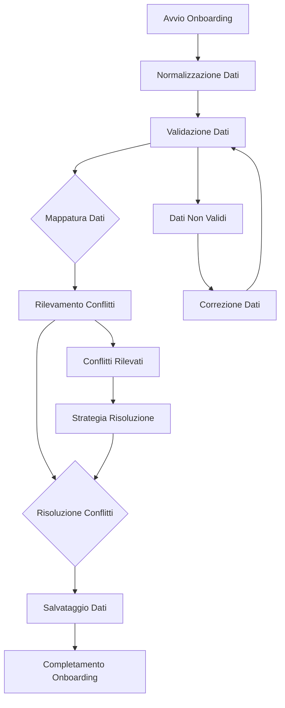

# Sistema di Gestione Dati Onboarding - Panoramica Completa

## 🎯 Obiettivo

Questo sistema fornisce una soluzione robusta e scalabile per gestire i dati dell'onboarding, prevenendo conflitti e garantendo la coerenza dei dati tra le diverse sezioni dell'applicazione.

## 🏗️ Architettura del Sistema

### Componenti Principali

1. **Data Normalizer** (`dataNormalizer.js`)
   - Normalizza e valida i dati dell'onboarding
   - Garantisce coerenza e integrità dei dati
   - Gestisce la pulizia dei dati corrotti

2. **Data Mapper** (`dataMapper.js`)
   - Mappa i dati normalizzati alle sezioni dell'app
   - Gestisce la trasformazione dei dati
   - Crea report di mappatura

3. **Conflict Resolver** (`conflictResolver.js`)
   - Rileva conflitti tra dati esistenti e nuovi
   - Risolve conflitti con strategie configurabili
   - Genera report di conflitti

4. **Data Logger** (`dataLogger.js`)
   - Traccia tutte le operazioni sui dati
   - Fornisce debugging e monitoraggio
   - Genera report di performance

5. **Onboarding Data Manager** (`onboardingDataManager.js`)
   - Gestore centralizzato del sistema
   - Coordina tutti i componenti
   - Fornisce API unificata

6. **Data Validator** (`dataValidator.js`)
   - Validazione avanzata dei dati
   - Test di robustezza del sistema
   - Controllo integrità

### Hook React

- **useOnboardingData** - Hook principale per gestire i dati
- **useOnboardingConflicts** - Hook per gestire i conflitti
- **useOnboardingMigration** - Hook per gestire la migrazione

### Componenti UI

- **OnboardingDataViewer** - Interfaccia per visualizzare e gestire i dati

## 🔄 Flusso di Lavoro



## 📊 Struttura Dati

### Dati Normalizzati

```javascript
{
  business: {
    name: string,
    address: string,
    phone: string,
    email: string,
    coordinates: object
  },
  departments: {
    list: Array<Department>,
    enabledCount: number
  },
  staff: {
    staffMembers: Array<StaffMember>
  },
  conservation: {
    points: Array<ConservationPoint>,
    count: number
  },
  tasks: {
    list: Array<Task>,
    count: number
  },
  products: {
    productsList: Array<Product>,
    count: number
  },
  savedMaintenances: Array<MaintenanceGroup>
}
```

### Dati Mappati

```javascript
{
  departments: Array<Department>,
  staff: Array<StaffMember>,
  refrigerators: Array<ConservationPoint>,
  cleaning: Array<Task>,
  products: Array<Product>,
  maintenanceTasks: Array<MaintenanceTask>,
  businessInfo: BusinessInfo
}
```

## 🛠️ Utilizzo

### Utilizzo Base

```javascript
import { onboardingDataManager } from './utils/onboardingDataManager';

// Avvia l'onboarding
await onboardingDataManager.startOnboarding(initialData);

// Aggiorna i dati di un step
await onboardingDataManager.updateStepData(stepNumber, stepData);

// Completa l'onboarding
const result = await onboardingDataManager.completeOnboarding();
```

### Utilizzo con React

```javascript
import { useOnboardingData } from './hooks/useOnboardingData';

function OnboardingComponent() {
  const {
    status,
    normalizedData,
    mappedData,
    conflicts,
    isLoading,
    error,
    startOnboarding,
    updateStepData,
    completeOnboarding,
    cleanup
  } = useOnboardingData();

  // Usa i dati e le funzioni...
}
```

## ⚙️ Configurazione

### Configurazione Conflitti

```javascript
const CONFLICT_RESOLUTION_CONFIG = {
  departments: {
    DUPLICATE_NAME: 'rename',
    DUPLICATE_ID: 'replace_with_new'
  },
  staff: {
    DUPLICATE_NAME: 'rename',
    DUPLICATE_ID: 'replace_with_new'
  }
};
```

### Configurazione Validazione

```javascript
const VALIDATION_RULES = {
  business: {
    name: { required: true, minLength: 2, maxLength: 100 },
    email: { required: false, pattern: /^[^\s@]+@[^\s@]+\.[^\s@]+$/ }
  }
};
```

## 🧪 Testing

### Test Automatici

```javascript
import { runAllSystemTests } from './utils/onboardingSystemTest';

// Esegui tutti i test
const results = await runAllSystemTests();
```

### Test di Robustezza

```javascript
import { runAllTests } from './utils/dataValidator';

// Testa la robustezza del sistema
const testResults = runAllTests();
```

## 📈 Monitoraggio

### Logging

```javascript
import { dataLogger } from './utils/dataLogger';

// Visualizza i log
const logs = dataLogger.getLogsByOperation('onboarding_start');

// Crea un report
const report = dataLogger.createLogReport();
```

### Report

```javascript
import { createOnboardingReport } from './utils/onboardingDataManager';

// Genera report completo
const report = createOnboardingReport();
```

## 🔧 Risoluzione Problemi

### Dati Corrotti

```javascript
import { cleanCorruptedData } from './utils/dataNormalizer';

// Pulisce i dati corrotti
cleanCorruptedData();
```

### Ripristino Backup

```javascript
import { restoreFromBackup } from './utils/dataMapper';

// Ripristina i dati dal backup
restoreFromBackup();
```

### Debug Conflitti

```javascript
import { createConflictReport } from './utils/conflictResolver';

// Crea report dettagliato dei conflitti
const report = createConflictReport(conflicts, resolutionLog);
```

## 🚀 Deployment

### Preparazione

1. Verifica che tutti i test passino
2. Configura le impostazioni per l'ambiente
3. Esegui test di performance
4. Crea backup dei dati esistenti

### Integrazione

1. Sostituisci la logica esistente di salvataggio
2. Aggiorna i componenti per usare i nuovi hook
3. Configura il sistema di logging
4. Testa l'integrazione completa

### Monitoraggio

1. Abilita il logging dettagliato
2. Monitora i conflitti e le risoluzioni
3. Verifica l'integrità dei dati
4. Genera report regolari

## 📚 Documentazione

- **README.md** - Guida all'utilizzo
- **SYSTEM_OVERVIEW.md** - Panoramica del sistema
- **onboardingIntegrationExample.js** - Esempi di integrazione
- **onboardingSystemTest.js** - Test del sistema

## 🔄 Manutenzione

### Aggiornamenti

1. Testa sempre le modifiche
2. Aggiorna la documentazione
3. Verifica la compatibilità
4. Esegui test di regressione

### Backup

1. Crea backup regolari
2. Verifica l'integrità dei backup
3. Testa il ripristino
4. Documenta i processi

### Monitoraggio

1. Monitora le performance
2. Traccia gli errori
3. Analizza i log
4. Ottimizza le operazioni

## 🎯 Best Practices

1. **Sempre normalizzare** i dati prima del salvataggio
2. **Gestire i conflitti** prima di applicare le modifiche
3. **Validare i dati** a ogni step
4. **Monitorare le operazioni** attraverso i log
5. **Creare backup** prima di operazioni critiche
6. **Testare la robustezza** con dati di test
7. **Documentare le modifiche** per facilitare la manutenzione
8. **Mantenere la coerenza** tra i diversi componenti

## 🚨 Avvertenze

- Non modificare la struttura dei dati senza aggiornare i normalizzatori
- Testare sempre le modifiche in un ambiente di sviluppo
- Mantenere la compatibilità con i dati esistenti
- Monitorare le performance con grandi volumi di dati
- Verificare l'integrità dei dati dopo ogni modifica

## 📞 Supporto

Per problemi o domande:
1. Consulta la documentazione
2. Esegui i test di sistema
3. Controlla i log per errori
4. Verifica la configurazione
5. Contatta il team di sviluppo

---

**Versione**: 1.0.0  
**Ultima modifica**: 2024-12-19  
**Autore**: Sistema di Gestione Dati Onboarding
